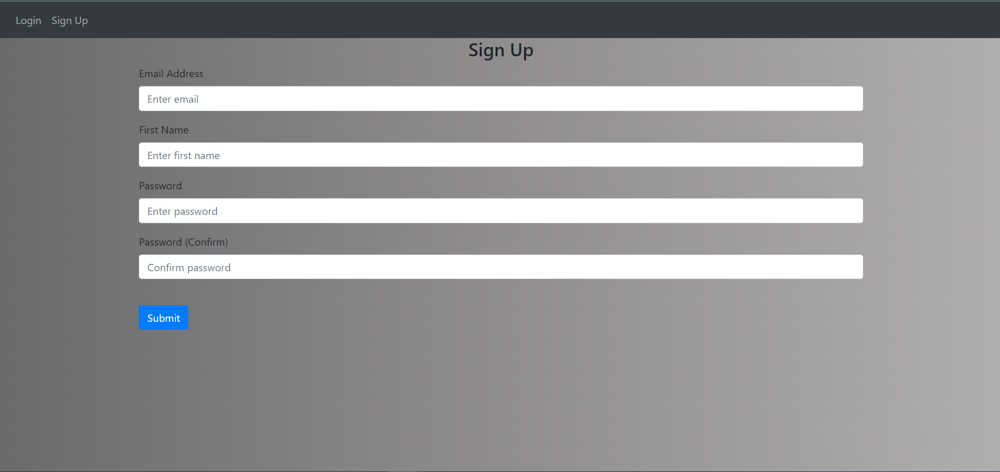
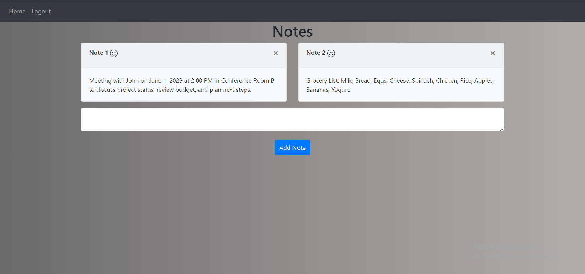

# Flask Notes App

This is a simple Flask web application that allows users to create and manage notes. The app uses Bootstrap for styling and includes authentication functionality.

## Installation

1. Clone the repository to your local machine.
2. Navigate to the project directory.
3. Run the app: `py main.py`

## Usage

1. Navigate to `http://localhost:5000` in your web browser.
2. To create a new account, view the signup page in your web browser

 
   
   
5. Log in with your new account by clicking the "Login" link in the navigation bar.
6. The home page would then appear.

 
 
8. Create a new note by typing your note text into the input field and clicking the "AddNote" button.
9. View your notes on the home page. You can delete a note by clicking the "x" button on the note card.

7. When you're finished, log out by clicking the "Logout" link in the navigation bar.
